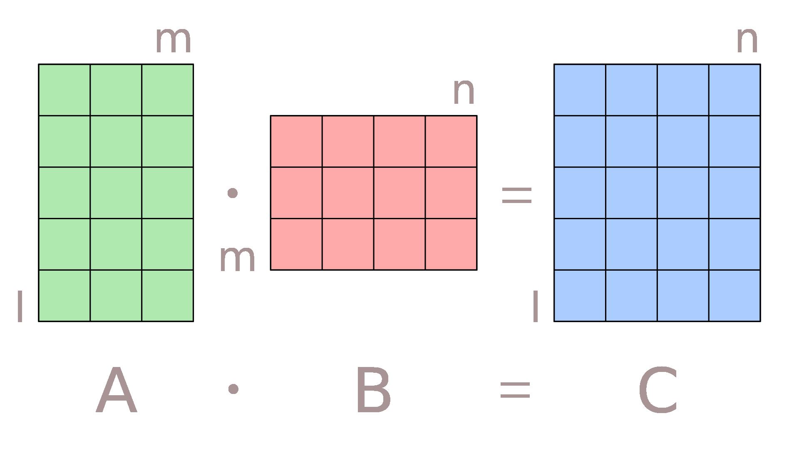

# matmult 
> A floating-point matrix multiplication implemented in hardware.

<p align="center">
 
</p>

---
**NOTE**

This project has been refactored, and updated to work with  Vivado 2020.2. The previous implementation can be found in the branch [vivado-2019.2](https://github.com/twaclaw/matmult/tree/vivado-2019.2).

---

This repo describes the implementation of a floating-point matrix multiplication on a [PYNQ-Z1](https://store.digilentinc.com/pynq-z1-python-productivity-for-zynq-7000-arm-fpga-soc/) development board. 

The hardware module implements the matrix product **C** = **AB**, where **A**, **B**, and **C** are 128 x 128 floating-point matrices.

This hardware accelerator provides a 3.4x speedup compared to NumPy.

## Repo Organization

* [[hls]](./hls) contains the accelerator *c++* source code for high level synthesis.
* [[boards/Pynq-Z1/matmult]](./boards/Pynq-Z1/matmult) contains the Vivado project.
* [[notebooks]](./notebooks) contains the Jupyter Notebook to evaluate the design. This folder also contains the required overlay generated with `vivado` and `vitis_hls` version 2020.2.

## Installation

* Copy the [notebooks/matmult](./notebooks/matmult) folder to the Jupyter notebooks area in the PYNQ-Z1 device. 

## Build
Requires Xilinx `vivado` and `vitis_hls` version 2020.2. If necessary, a different version can be configured in [matmult.tcl](./boards/Pynq-Z1/matmult/matmult.tcl).


* Build the `matmult` module:
    ```bash
    vitis_hls script.tcl
    ```
* Build the Vivado project:
    ```bash
    cd boards/Pynq-Z1/matmult
    make clean  && make all
    ```
## Credits

* The original implementation borrowed ideas and code from [this application note](https://www.xilinx.com/support/documentation/application_notes/xapp1170-zynq-hls.pdf) (Copyright (c) 2016, Xilinx, Inc.), and the [PYNQ hello world example](https://github.com/Xilinx/PYNQ-HelloWorld).
* Schematic of matrix multiplication taken from [Wikipedia](https://en.wikipedia.org/wiki/Matrix_multiplication#/media/File:Matrix_multiplication_qtl1.svg)

